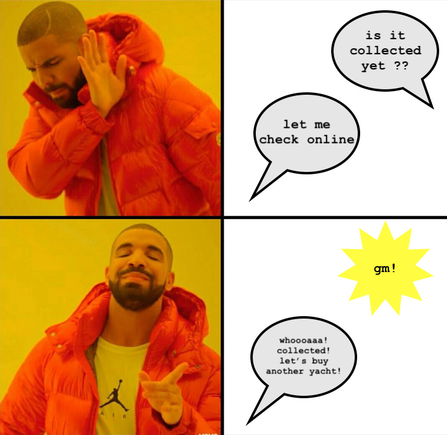
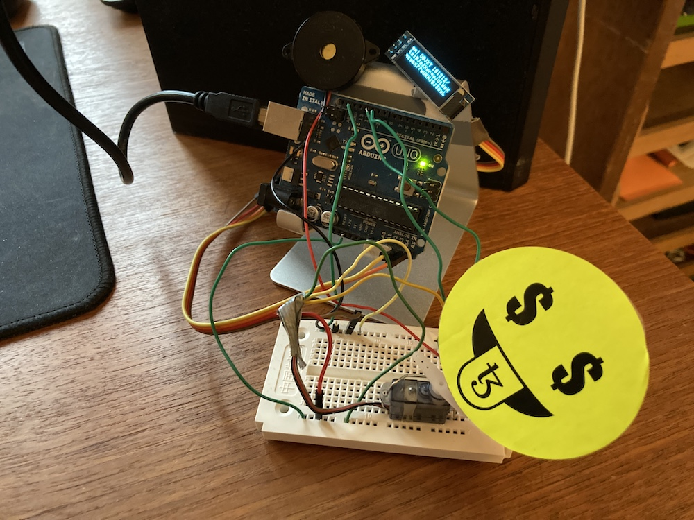
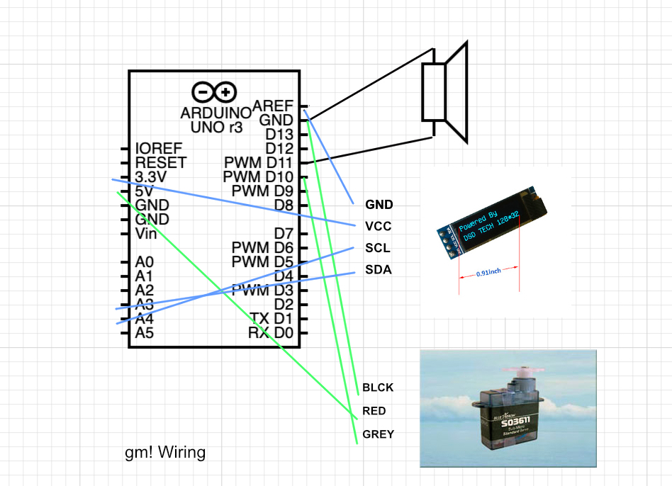

# gm!

Here is a video:
https://youtu.be/Fhfa-V7M3dk

*Update: gm! received a prize at HACK THE METAVERSE by [despace Berlin](https://www.despace.berlin/). A big thank you to anyone.*

### Connecting the virtual and physical metaverse in a playful manner.

The metaverse - a concept originally from Neil Stephenson's sci-fi novel "Snow Crash" - has stirred debates and drawn strong views from commentators. Especially since large gaming and social media companies have started claiming the concept for themselves, criticism has peaked. However, some of the self-professed "metaverse critics" seem unaware that they inherently accept and confirm the takeover by dismissing the concept altogether, playing the game of [INSERT MEGACORP HERE]. 

A different mindset is to resist appropriation, with artists and hackers exploring *their ideas* what a metaverse could be instead, through communities, discussions and experimentation. Let's draw a distinction between these approaches. 

While a metaverse understood in this way resists definition, some directions I think are interesting to explore:
   
* **ownership** - green blockchain technology such as [Tezos](https://tezos.com/) enables us to experiment with alternative economic models 
* **mixed reality** - the metaverse will bridge physical and digital manifestations through VR/AR/XR/IoT 
* **decentralization** - a catastrophic DNS failure can bring down Facebook but it cannot stop [Hic et Nunc](https://github.com/i3games/hen-timeline/blob/main/timeline.md)
* **identities** - we can play with multiple identities and avatars that persist beyond the realm of a specific world 
* **openness** - open standards, open minds, open communities - it is time to get rid of old gatekeeping mindsets

This small prototype attempts to embody the first two of these, to make the collection of an OBJKT (an NFT on Hic et Nunc) more playful and to delight the artist whose piece is collected. 

In short, it notifies you when your piece gets collected. 

This meme:



Technically, it works by subscribing to a service, listening to collect transactions and looking for a particular OBJKT on [Hic et Nunc](https://hicetnunc.art/). When that NFT is being collected, the script sends out a signal to a piezo speaker, a matrix display and a servo motor. That's it - the complete code, written in JavaScript with the libraries mentioned below, is available in file `main.js`. Use at your own risk.

Some next steps: thorough testing, making the code more robust against errors, adding more redundancy for collection detection (it sometimes seems to miss one), adding a front end for entering OBJKT numbers, supporting more contracts.    

From this small prototype, imagine what we can do in future iterations: play sound from a synthesizer, trigger a massage ([a friend of mine makes soft robots that can do this](https://feuetbois.net/)), or start a little robot that stops by and says "gm!" (gm stands for "Good Morning", a friendy phrase in the community). Imagine how you create a different effect for each of your OBJKTs. It is up to you what it can do, only limited by your imagination.  

---

Made for the https://www.despace.berlin/hack-the-metaverse hackathon in December 2021, solo project in 48 hours. 
Sticker created by Anita Sengupta (tzconnect).

MIT License 

### Parts list

* Arduino UNO 
* Servo Motor - I am using a [Blue Arrow SO3611](https://servodatabase.com/servo/blue-arrow/s03611)
* OLED Mini Display - e.g. [DSD TECH 0.91 inch(128x32)](http://www.dsdtech-global.com/2018/05/iic-oled-lcd-u8glib.html) 
* Piezo Speaker
* a breadboard
* cables, a USB cable

### Prerequisites

[node.js](https://nodejs.org/en/), libraries: [SignalR](https://www.npmjs.com/package/@microsoft/signalr), [Johnny Five](http://johnny-five.io/), [oled-js](https://github.com/noopkat/oled-js), [oled-font-5x7](https://github.com/noopkat/oled-font-5x7). Uses the [TzKT API](https://api.tzkt.io/) (v1.6.3) by Baking Bad Team.

To install, run 
`npm install`

To start, run
`node main.js`

In the Arduino IDE load the "Examples -> Firmata -> StandardFirmataPlus" sketch. Then close the IDE. In this project we use node.js to talk to the Arduino running the Firmata sketch. 

To test collecting, you need a Tezos wallet - I am using [Temple](https://templewallet.com/). I made a special NFT for development https://hicetnunc.art/objkt/181212 (0.01 tez, currently a few cents) but you can use any OBJKT number you want of course. Enter the number of your OBJKT on this line:

```
const OBJKT_ID = "181212";  // put your OBJKT ID here
```

Note this transaction happens on the Tezos Mainnet using the original Hic et Nunc smart contract, so when running the code in this repository, the effect is triggered when you are actually collecting the NFT.  

### Physical Setup



Wiring schema



The server can run on a Raspberry Pi, see `RaspberryPi.md`

Questions? Twitter! [@crcdng](https://twitter.com/crcdng)

