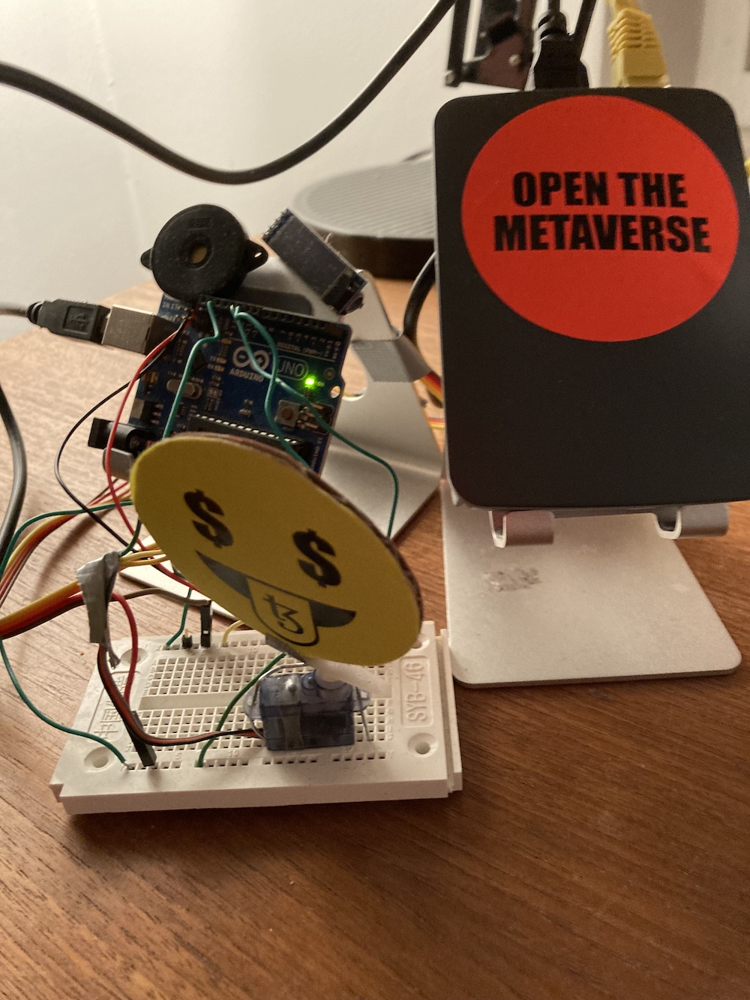

## setup a Raspberry Pi 
(I use a Raspberry Pi 2b+)

Install Raspbian Light

> sudo apt-get update    
> sudo apt-get dist-upgrade    

## install node.js and git

> curl -sL https://deb.nodesource.com/setup_17.x | sudo bash -    
> sudo apt install nodejs    
> node -v    

> sudo apt install git    
> git --version    

## setup the repo

> git clone https://github.com/i3games/gm.git    
> cd gm    
> npm install        

## connect the Arduino via USB to the Raspberry Pi

## run
> node main.js    